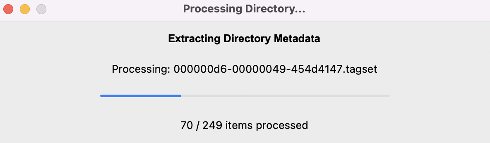
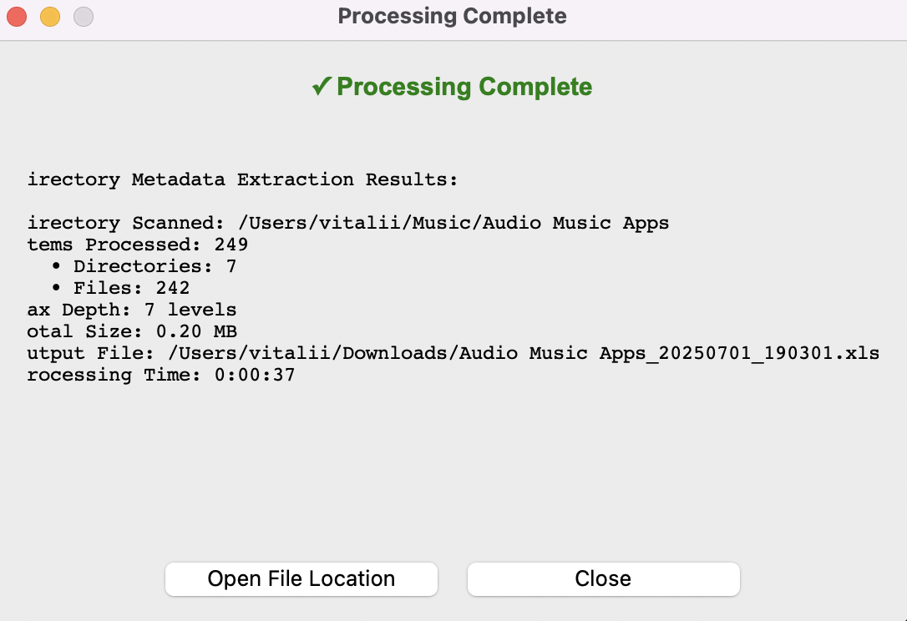
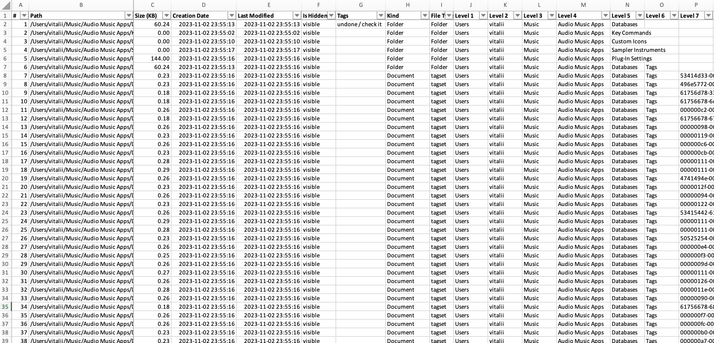
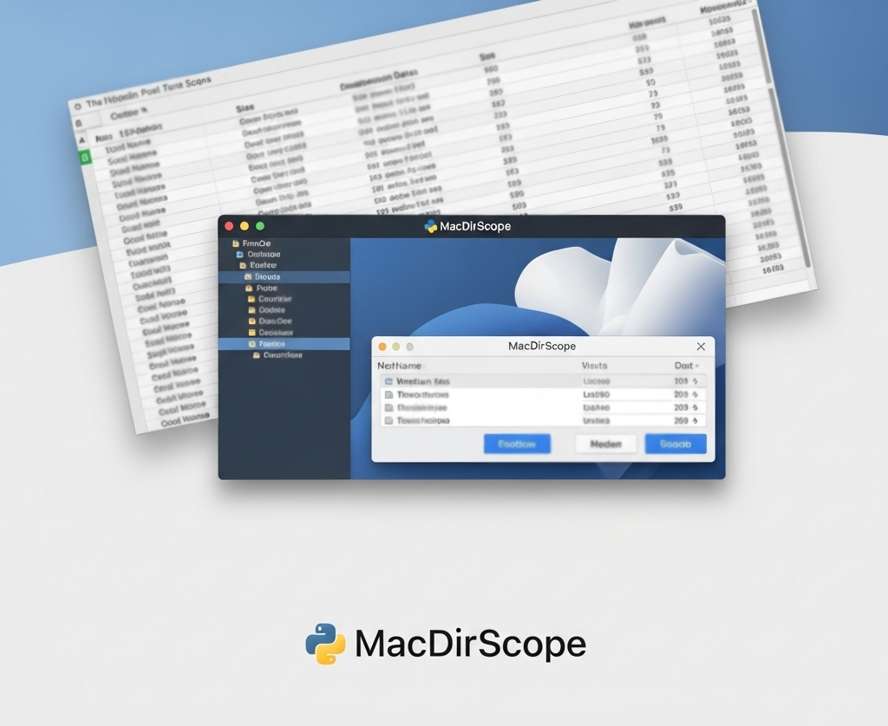

# MacDirScope

MacDirScope is a Python utility for macOS that scans a directory, extracts rich filesystem and extended metadata (including Finder tags), and exports the results into a structured, well-formatted Excel spreadsheet. It’s designed to be a powerful tool for cataloging, auditing, and reporting on the contents of your folders 📂 ➡️ 📊


 

**➡️ Read more about the project, its features, and development in my [Medium story.](https://medium.com/@starosta/organize-mac-files-free-01d2e1b5c8f8)** 


## Table of Contents

- [Overview](#overview)
- [Features](#features)
- [Installation](#installation)
- [Usage](#usage)
- [Project Structure](#project-structure)
- [Development](#development)
- [Known Issues](#known-issues)
- [Contributing](#contributing)
- [License](#license)
- [Contact](#contact)

## Overview

MacDirScope provides an intuitive GUI that allows users to:

1.  **Select any directory** on their macOS system.
2.  **Extract comprehensive metadata**, including standard file info (size, dates) and extended macOS attributes like Finder Tags and Kind information via the `mdls` command.
3.  **Monitor progress** with a real-time status window.
4.  **Export the data** to an Excel workbook using OpenPyXL, complete with custom formatting and filter-friendly columns.

This tool aims to simplify the process of creating detailed filesystem inventories for digital asset management, project audits, or personal organization.

## Features

-   **Rich Metadata Extraction:** Gathers not just standard file info but also unique macOS metadata like Finder Tags and Kind descriptions.
-   **High-Performance Scanning:** Utilizes an efficient pre-computation step to calculate all directory sizes at once, making it very fast on large and complex folders.
-   **User-Friendly GUI:** Provides native graphical dialogs for selecting directories and a real-time progress bar during the scan.
-   **Hierarchical Folder Levels:** Automatically splits folder paths into separate columns (`Level 1`, `Level 2`, etc.) for easy filtering and sorting in Excel.
-   **Formatted Excel Output:** Generates a professional `.xlsx` file with formatted dates, adjusted column widths, and a frozen header row for easy analysis.
-   **Completion Summary:** Displays a final report detailing the number of items processed, total size, and processing time.

## Installation

### Prerequisites

Ensure you have Python 3 installed. This tool is designed for **macOS only**.
MacDirScope relies on the following libraries:
- `openpyxl`
- `tkinter` (usually included with Python)

### Clone the Repository
```bash
git clone https://github.com/sztaroszta/MacDirScope.git
cd MacDirScope
```

### Install Dependencies

You can install the required dependency using pip:

```bash
pip install -r requirements.txt
```

*Alternatively, install the dependency manually:*

```bash
pip install openpyxl
```

## Usage

**1. Run the application:**

```bash
python mac-dir-scope.py
```

**2. Follow the Prompts:**

-   **Select Directory**: A file dialog will appear; choose the folder you want to scan.
-   **Save Excel File**: Choose the location and filename for the Excel output. The default name will include the folder name and a timestamp.

**3. Monitor Progress:**

-   A progress window will show the status of the scan, including the number of items processed.

    

**4. Review the Output:**

-   A summary window will show the results of the scan.

    

-   Open the generated Excel file to review your organized filesystem data. The spreadsheet will include:
    -   File paths, sizes, creation dates, and modification dates.
    -   Special macOS columns for Finder Tags and Kind.
    -   Each folder level in a separate column for easy filtering.

    

## Project Structure

```
MacDirScope/
├── mac-dir-scope.py        # Main script for running the tool
├── README.md               # Project documentation
├── requirements.txt        # List of dependencies
├── .gitignore              # Git ignore file for Python projects
├── assets/                 # Contains screenshots of the application's UI
└── LICENSE                 # [Your Chosen License] License File
```

-   **macdirscope.py**: Contains the complete program with all GUI components, metadata extraction logic, and Excel export functionality.
-   **assets/**: Contains screenshots that illustrate the application's user interface and functionality.
-   **LICENSE**: Defines the usage rights for the project.

## Development

**Guidelines for contributors:**

If you wish to contribute or enhance MacDirScope:
-   **Coding Guidelines:** Follow Python best practices (PEP 8). Use meaningful variable names and add clear comments or docstrings.
-   **Testing:** Test changes locally on a macOS environment to ensure functionality is not broken.
-   **Issues/Pull Requests:** Please open an issue or submit a pull request on GitHub for enhancements or bug fixes.

## Known Issues

-   The tool is **macOS-specific** and will not run on Windows or Linux due to its reliance on the `mdls` command and `st_birthtime` for file creation dates.
-   Accessing certain system-protected directories may result in permission errors, which will be logged as errors in the processing statistics.

## Contributing

**Contributions are welcome!** Please follow these steps:

1.  Fork the repository.
2.  Create a new branch for your feature or fix.
3.  Commit your changes with descriptive messages.
4.  Push to your fork and submit a pull request.

For major changes, please open an issue first to discuss the proposed changes.

## License

Distributed under the MIT License.
See [LICENSE](LICENSE) for full details.


## Contact

For questions, feedback, or support, please open an issue on the [GitHub repository](https://github.com/sztaroszta/MacDirScope/issues) or contact me directly: 

[](https://www.linkedin.com/in/vitalii-starosta)
[](https://github.com/sztaroszta)
[](https://gitlab.com/sztaroszta)
[](https://bitbucket.org/sztaroszta/workspace/overview)
[]( https://gitea.com/starosta) 

Projects Showcase: [sztaroszta.github.io](https://sztaroszta.github.io)

**Version:** 6  
**Concept Date:** 2024-02-14 




