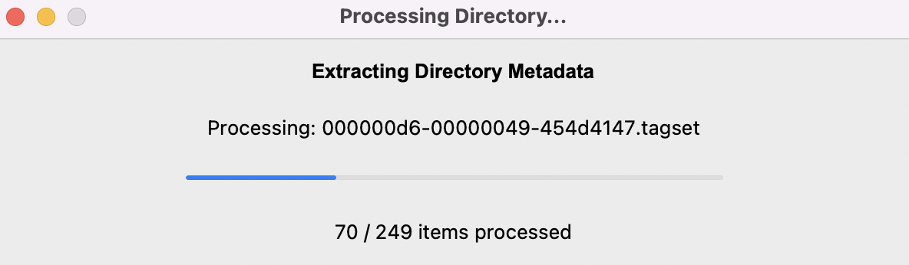
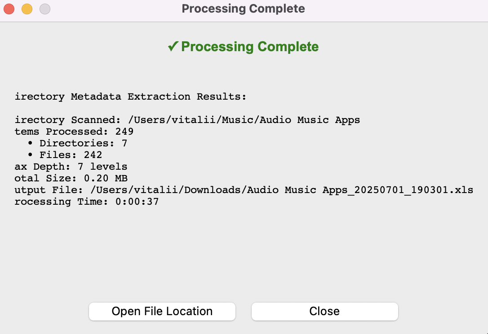
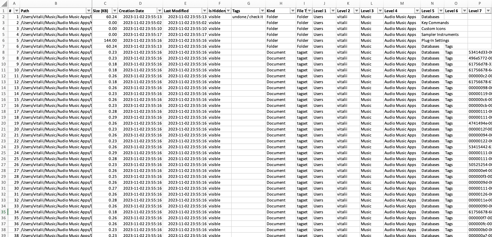
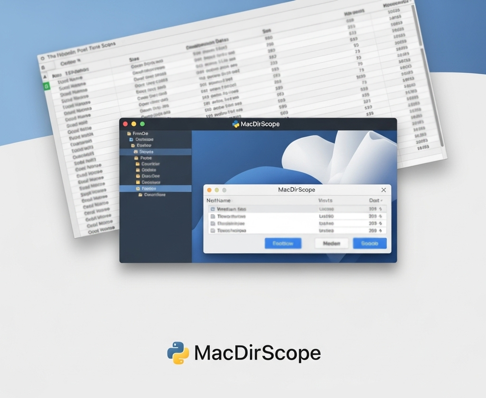

# MacDirScope

A macOS-native GUI utility engineered to scan directory hierarchies, pre-compute folder storage footprints, extract rich filesystem and extended Spotlight metadata (Finder tags, Kind descriptions, image/video resolution, audio/video duration), and export the results into a structured, production-ready Excel workbook 📂➡️📊


<p align="center">  </p>

<p align="center">
  <a href="https://starosta.app">
    
  </a>
</p>

**➡️ Read more about the project, its features, and development in my [Medium story](https://medium.com/@starosta/organize-mac-files-free-01d2e1b5c8f8) or visit the [Interactive Showcase](https://starosta.app/#project-macdirscope).**

## Table of Contents

- [Overview](#overview)
- [Key Features](#key-features)
- [Installation](#installation)
- [Usage](#usage)
- [Project Structure](#project-structure)
- [Development](#development)
- [Known Issues](#known-issues)
- [Contributing](#contributing)
- [License](#license)
- [Contact](#contact)

## Overview

MacDirScope simplifies the process of auditing, cataloging, and analyzing complex folder structures on macOS. While standard terminal commands provide raw text and Finder provides only fragmented views, MacDirScope extracts deep filesystem attributes and Spotlight metadata, combining them into an interactive, filter-friendly Excel spreadsheet.

The core strength of MacDirScope is its **two-stage optimized engine**. Before inspecting individual items, it performs a single pre-scan to calculate and aggregate directory sizes from the bottom up. During the scan, it queries macOS Spotlight (`mdls`) for native tags, file kinds, and optional media metrics (resolution and duration), skipping redundant calls on non-media files to ensure maximum scanning speed.

### Problem it Solves

- **Recursive Sizing Bottlenecks:** Calculates accurate subdirectory sizes in a single pre-computation pass, eliminating the system freezes typical of recursive folder recalculations.
- **Hidden macOS Metadata Access:** Extracts native Finder color tags and Spotlight "Kind" descriptors that standard command-line tools often miss.
- **Media Asset Auditing:** Instantly retrieves image/video dimensions (e.g., `1920x1080`, `3840x2160`) and media playback durations (e.g., `03:45`, `01:14:22`) directly into spreadsheet rows without third-party heavy media suites.
- **Hierarchical Path Analysis:** Automatically splits nested directory paths into discrete `Level 1`, `Level 2`, etc., columns, enabling rapid Excel filtering and pivot-table analysis.

### Typical Workflow

1. Launch the application and select your source directory via the native macOS folder dialog.
2. Confirm or customize the timestamped output Excel path (e.g., `FolderName_YYYYMMDD_HHMMSS.xlsx`).
3. Configure optional columns in the **Scan Configuration** window: toggle **Image/Video Resolution** and/or **Media Duration**, or simply click **Proceed** to keep standard columns.
4. Monitor the non-blocking progress bar as the utility processes files and folders.
5. Review the completion summary report and click **"Open File Location"** to reveal the formatted spreadsheet immediately in macOS Finder.

## Key Features

- **Rich Metadata Extraction:** Gathers filesystem timestamps (creation, last modified), sizes in KB, hidden file states, Finder User Tags, and macOS Kind descriptors via `mdls`.
- **Optional Media Resolution Column:** Queries pixel dimensions (`WidthxHeight`) for images (`.jpg`, `.png`, `.heic`, `.webp`, `.tiff`, etc.) and videos (`.mp4`, `.mov`, `.mkv`, etc.).
- **Optional Media Duration Column:** Queries and formats playback duration (`HH:MM:SS` or `MM:SS`) for videos and audio files (`.mp3`, `.wav`, `.m4a`, `.flac`, etc.).
- **Intelligent Extension Filtering:** Limits media metadata calls strictly to supported extensions, preventing system process bottlenecks on documents, code files, and archives.
- **High-Performance Pre-Computation:** Calculates directory storage footprints using bottom-up path aggregation for extreme performance on large directory trees.
- **Hierarchical Level Splitting:** Dynamically splits file paths into numbered columns (`Level 1`, `Level 2`, `...`) based on the maximum folder depth detected.
- **Production-Ready Excel Output:** Generates styled workbooks with auto-fit column widths, frozen top panes at `C2`, active auto-filters, formatted timestamps, and two-decimal numeric sizes.
- **One-Click File Reveal:** Includes an auto-reveal action in the completion modal to open the target folder directly in macOS Finder (`open -R`).

## Installation

### Prerequisites

Ensure you have Python 3 installed. This tool is designed for **macOS only**.
MacDirScope relies on the following libraries:
- `openpyxl`
- `tkinter` (usually included with Python)

### Clone the Repository
```bash
git clone https://github.com/sztaroszta/MacDirScope.git
cd MacDirScope
```

### Install Dependencies

You can install the required dependency using pip:

```bash
pip install -r requirements.txt
```

*Alternatively, install the dependency manually:*

```bash
pip install openpyxl
```

## Usage

**1. Run the application:**

```bash
python mac_dir_scope.py
```

**2. Follow the Prompts:**

-   **Select Directory**: A file dialog will appear; choose the folder you want to scan.
-   **Save Excel File**: Choose the location and filename for the Excel output. The default name will include the folder name and a timestamp.
-   **Configure Options**: A window will appear allowing you to optionally tick image/video resolution and media duration. Click "Proceed" to continue.

**3. Monitor Progress:**

-   A progress window will show the status of the scan, including the number of items processed.

    

**4. Review the Output:**

-   A summary window will show the results of the scan.

    

-   Open the generated Excel file to review your organized filesystem data. The spreadsheet will include:
    -   File paths, sizes, creation dates, and modification dates.
    -   Special macOS columns for Finder Tags and Kind (as well as optional Resolution and Duration).
    -   Each folder level in a separate column for easy filtering.

    

## Project Structure

```
MacDirScope/
├── mac_dir_scope.py        # Main script for running the tool
├── README.md               # Project documentation
├── requirements.txt        # List of dependencies
├── .gitignore              # Git ignore file for Python projects
├── assets/                 # Contains screenshots of the application's UI
└── LICENSE                 # MIT License File
```

-   **macdirscope.py**: Contains the complete program with all GUI components, metadata extraction logic, and Excel export functionality.
-   **assets/**: Contains screenshots that illustrate the application's user interface and functionality.
-   **LICENSE**: Defines the usage rights for the project.

## Development

**Guidelines for contributors:**

If you wish to contribute or enhance MacDirScope:
-   **Coding Guidelines:** Follow Python best practices (PEP 8). Use meaningful variable names and add clear comments or docstrings.
-   **Testing:** Test changes locally on a macOS environment to ensure functionality is not broken.
-   **Issues/Pull Requests:** Please open an issue or submit a pull request on GitHub for enhancements or bug fixes.

## Known Issues

- **macOS Exclusive:** Relies on `mdls` (macOS Metadata CLI) and `os.stat().st_birthtime`. Will not run on Windows or Linux.
- **Spotlight Indexing Dependency:** Extended metadata attributes (`Tags`, `Kind`, `Resolution`, `Duration`) depend on files being located on volumes with active macOS Spotlight indexing.
- **Permission Access Restrictions:** Scanning system-protected areas (e.g., `~/Library`, `~/Documents` without terminal privileges) may cause permission errors, which are caught and counted in the final error statistics.

## Contributing

**Contributions are welcome!** Please follow these steps:

1.  Fork the repository.
2.  Create a new branch for your feature or fix.
3.  Commit your changes with descriptive messages.
4.  Push to your fork and submit a pull request.

For major changes, please open an issue first to discuss the proposed changes.

## License

Distributed under the MIT License.
See [LICENSE](LICENSE) for full details.


## Contact

[](https://starosta.app)

---

For questions, feedback, or support, please open an issue on the [GitHub repository](https://github.com/sztaroszta/MacDirScope/issues) or contact me directly:

[](https://www.linkedin.com/in/vitalii-starosta)
[](https://github.com/sztaroszta)
[](https://gitlab.com/sztaroszta)
[](https://bitbucket.org/sztaroszta/workspace/overview)
[](https://gitea.com/starosta)

Project Showcase: [starosta.app](https://starosta.app)

**Version:** 8
**Concept Date:** 2024-02-14


